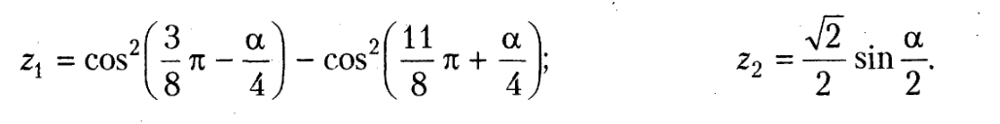

## Теоретическая часть

<ul>
    <li>Основные файлы в папке app Angular-приложения</li>
    <li>Задание глобальных стилей</li>
    <li>Задание стилей компонента</li>
    <li>Размещение и подключение статических файлов проекта</li>
    <li>Назначение файлов компонента на примере главного компонента приложения</li>
    <li>Понятие о декораторах, декоратор @Component</li>
    <li>Основные параметры декоратора</li>
    <li>Вывод свойств и результатов методов класса компонента в разметку компонента, синтаксис интерполяции</li>
    <li>Модуль компонента, регистрация компонента в модуле, декоратор NgModule</li>
    <li>Задание списка компонентов для размещения в index.html</li>
    <li>Создание компонентов, команда AngularCLI создания компонентов</li> 
    <li>Понятие о маршрутизации в Angular</li>
    <li>Построение маршрутов, регистрация маршрутов в модуле компонента приложения, селектор <router-outlet></li>
    <li>Атрибут элемента &lt;a&gt; для задания ссылки на компонент</li>
</ul>

## Практическая часть

    Разработайте приложение <b>Angular</b> с тремя компонентами, маршрутизацией по этим компонентам.

    <b>Компонент 1</b>. В классе компонента разработать метод для вычисления и вывода в разметку значений z1, z2 по заданию. В качестве исходных данных примите случайные значения, формируемые в классе компонента.

    <b>Компонент 2</b>. В произвольном тексте, заданном присваиванием в классе компонента, найти самое длинное и самое короткое
    слово. Вывести текст и эти слова в разметку компонента.

    <b>Компонент 3</b>. Хранение и вывод данных о товаре – наименование, цена, количество, изображение товара.

## Дополнительно

    Запись занятия можно скачать <a href="https://cloud.mail.ru/public/32or/uQ41QrZcZ">по этой ссылке</a>, материалы занятия в прикрепленном архиве.

