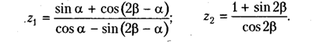

  <h3>Пример испобьзования сервиса - сервис для формирования данных о флоте</h3>
  <h3>Теоретическая часть</h3>
    <ul>
      <li>Декоратор @ViewChildren – доступ к нескольким компонентам в разметке</li>
      <li>Декоратор @ContentCild – доступ к одному элементу при помощи контейнера ng-context</li>
      <li>Декоратор @ContentChildren – доступ к нескольким компонентам при помощи контейнера ng-context</li>
      <li>Жизненный цикл компонента – основные события</li>
    </ul>
  <h3>Практическая часть</h3>
  

    <b>Задача 1.</b> Компонент C1 по клику на кнопку выдает два случайных числа (вещественных).
    Компонент C2 принимает эти числа, вычисляет по заданию z1, z2
    
    и эмитирует событие ResultReady компонент C3 обрабатывает событие, выводит
    z1, z2 и если z1 == z2 до 10го знака делает фон зеленым, иначе - красным.
  

  

  <b>Задача 2.</b>  Требуется хранить в локальном хранилище коллекцию сведений
    о кораблях: тип, название, длина, ширина, водоизмещение, год постройки, фото
    корабля. Инициализация коллекции сведений о кораблях должна проводиться при
    отсутствии данных в хранилище (формируйте не менее 10 записей, фото – из заранее
    заготовленных).
  

  
Функционал для разработки:

  <ul>
    <li>вывод всей коллекции в исходном порядке</li>
    <li>вывод коллекции, упорядоченной по возрастанию года изготовления</li>
    <li>вывод коллекции, упорядоченной по убыванию водоизмещения</li>
    <li>вывод коллекции, упорядоченной по названиям кораблей</li>
    <li>добавление корабля в коллекцию (генерация данных, не требуется использовать форму)</li>
    <li>удаление корабля из коллекции</li>
  </ul>
  

    <b>Задача 3.</b> Реализуйте карусель для вывода всех фотографий кораблей, хранящихся
    в Вашем приложении
  

  <h3>Дополнительно</h3>
  
Запись занятия можно скачать <a href="https://cloud.mail.ru/public/Vx9C/tmydgT3jV">
    <b>по этой ссылке</b></a>, материалы занятия в прикрепленном архиве.

